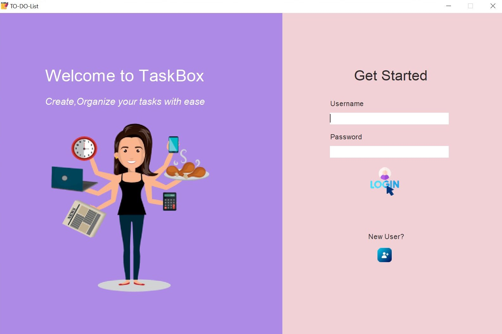
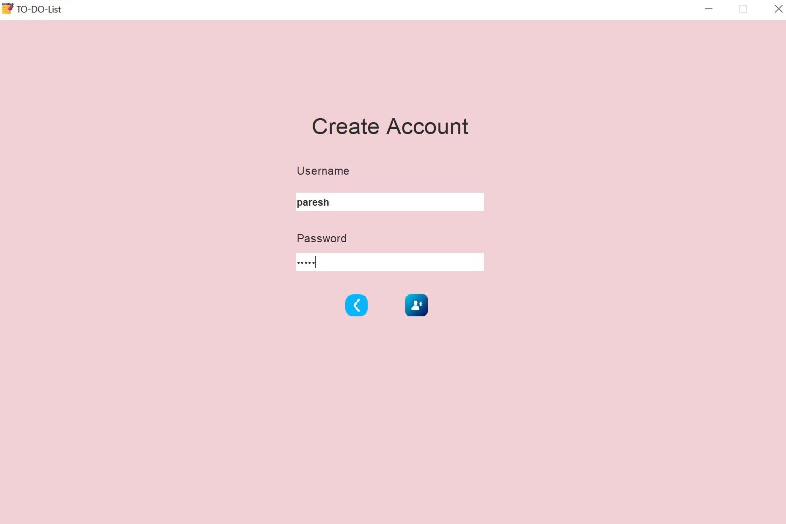
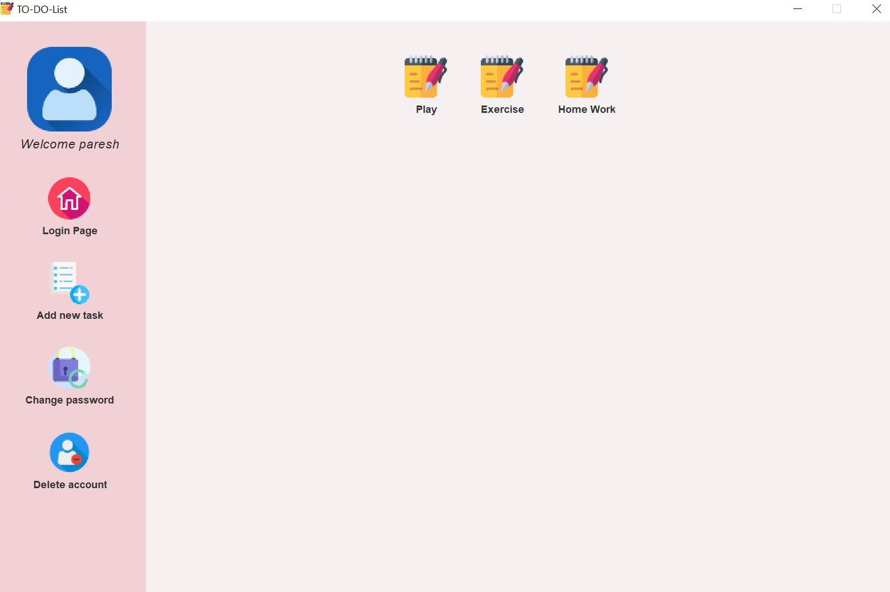

# TaskBox a To-Do list app using Java

A To-Do List app using java. User can create account, login, add tasks, change or delete tasks, change password and delete account. Data is stored in text files and read when the program starts. 

## Required Packages

* Swing (GUI widget toolkit for Java)

## IDE Used

* IntelliJ IDEA

## How to run

* In IDE

```
Run Main.java in your IDE.
```

* In Linux

Compile

```
javac Main.java
```

Run

```
java Main
```

## Images

* Login page



* Register



* View and add Task


